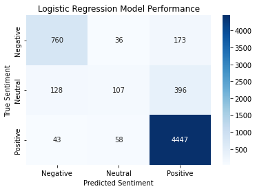

# tripadvisor_reviews sentiment analysis and modelling

# Project/Goals
The goal of this project is to analyze the semantics of tripadvisor reviews to determine if a new review was given, what kind of rating/sentiment it would receive. EDA will be performed to see common words within each rating to investigate certain key words that the model may use to evaluate a review. 

# Process
1. Perform EDA on the dataset

    -Create visualizations of the words in a wordcloud

    -Create graphs depicting the number of words overall and within each rating category

2. Experiment with several models to determine which one had the best results

    -Naive bayes, random forest, xgboost and neural networks(utilizing transfer learning)

# Results EDA

Looking at the data itself, the top ten words for the whole corpus of text is as follows:

Just from the words here, it is seen that every review had mentioned their hotel and room. The word not is tricky to decipher as it could be neutral, positive or negative depending on how it is used in the sentence. Although the next words are positive such as great and good, the corpus of text was heavily biased towards the higher ratings. 

Separating the ratings and looking into its own graphs yields these results. 

It is evident that more positive words are seen in higher rated reviews and more negative words are seen in lower rated reviews. The neutral stand point at 3 is when the word great starts to pop up and bring the negative semantics to a more positive standpoint. Service was an issue as it can be seen in one and two rated reviews. Not is a word that is pretty prominent in all five graphs but there is a trend of it appearing less as the reviews become more positive. This indicates that the word not carries a more negative meaning than its neutral/positive usage in the reviews. 

# Results Modelling

Overall, the best default performing model was the logistic regression. The XGBoost model was similar to the logistic regression model but its values for predicting negative sentiment was worse by around 5%. Both the Random Forest and Naive Bayes model were not able to predict the neutral sentiment as both showed 0 predictions in the confusion matrix. The neural network was the worst model in every aspect. It took long to train that provided with the worst accuracy and f1 score. The model is having trouble on its validation set and with regularization in almost every other layer, it still had issues. This could be due to the lack of data as the data was heavily biased towards the positive sentiment. 

Below are the confusion matrix for each of the models

